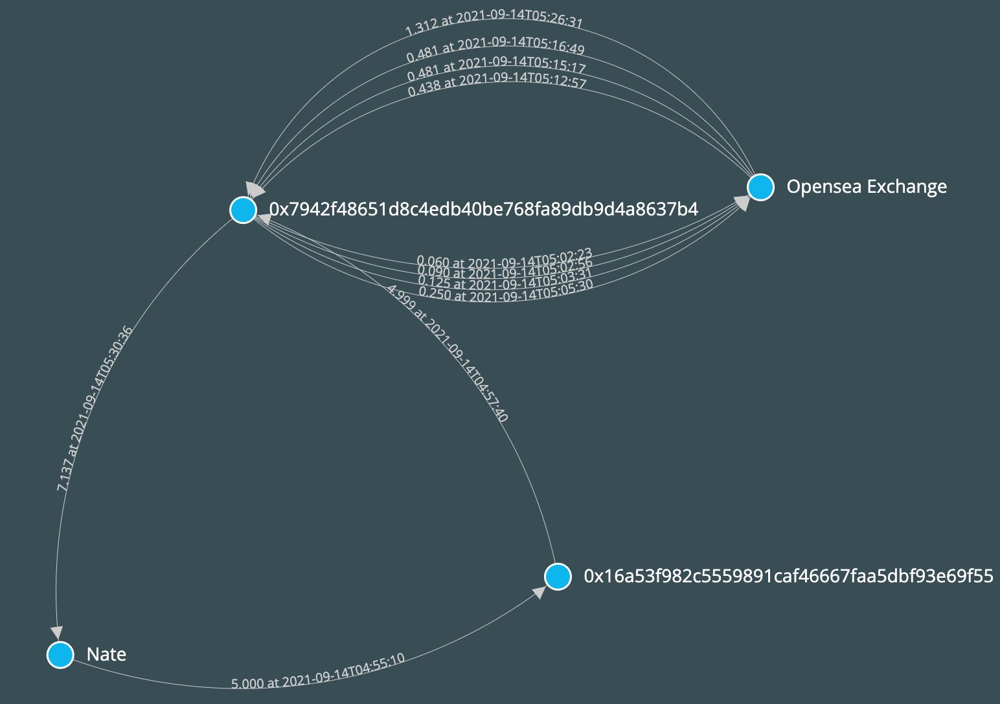

# NFT front running detection using graph algorithm

This repo provides sample data and example code to detect NFT frontrunning behavior by former Opensea head of product, Nate Chastain.
The sample dataset contains all transactions 3 degrees or less from Nate's main wallet `0xa3a4548b39da96eb065ff91811ca30da40431c0d`.
The example code in Jupyter notebook use graph algorithm to find the signatures of the frontrunning behavior involving Nate's main wallet, and visualizes them using D3.js.

## How to use
- create a python environment using `pyenv`
- activate environment and run `pip install -r requirements.txt`
- run jupyter lab
- play through the `detection_script` notebook